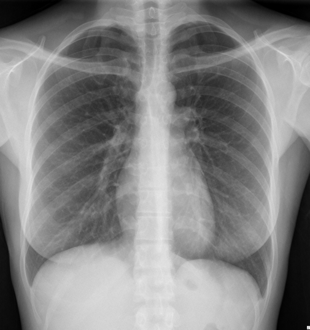

# BRAX Brazilian Chest X-ray

<div align="center">
    <a href="https://github.com/openmedlab/"></a>
</div>
<p style="text-align:center;font-size:10px;"><em></em></p>

## Dataset Information

The Brazilian Annotated X-ray (BRAX) dataset is an automatically annotated dataset consisting of chest X-ray studies from 24,959 patients in a large general hospital in Brazil. The dataset contains a total of 40,967 images.

### 14 Labels
Labels were automatically extracted from medical reports in Portuguese using NLP tools:

1. **No Finding**: Value is 1 if no other label is present, except for support devices.
2. **Enlarged Cardiomediastinum**
3. **Cardiomegaly**
4. **Lung Lesion**
5. **Lung Opacity**
6. **Edema**
7. **Consolidation**
8. **Pneumonia**
9. **Atelectasis**
10. **Pneumothorax**
11. **Pleural Effusion**
12. **Pleural Other**
13. **Fracture**
14. **Support Devices**

### "master_spreadsheet.csv"
Each row in the dataset includes the following information:

- **PatientID**: A unique identifier for the patient. As part of the de-identification procedure, patient IDs were randomly generated.
- **PatientSex**: The sex of the patient. Enumerated values:
  - "M" for male
  - "F" for female
  - "O" for other
- **PatientAge**: Patient's age is provided in 5-year age groups. Patients aged 85 or older are classified as "85 or more."
- **AccessionNumber**: A DICOM identifier for the study. This was randomly generated as part of the de-identification process.
- **StudyDate**: A fictitious date for the study.
- **Labels**: Columns indicating the presence of the 14 labels. The code "1" represents positive, "0" represents negation, and "-1" indicates uncertainty.
- **ViewPosition**: The radiographic view associated with the patient's position. Defined terms:
  - AP - Anterior/Posterior
  - PA - Posterior/Anterior
  - LL - Left Lateral
  - RL - Right Lateral
  - RLD - Right Lateral Decubitus
  - LLD - Left Lateral Decubitus
  - RLO - Right Lateral Oblique
  - LLO - Left Lateral Oblique
- **Rows**: The size (number of pixels) along the vertical axis of the image matrix.
- **Columns**: The size (number of pixels) along the horizontal axis of the image matrix.
- **Manufacturer**: An index representing the CT scanner's manufacturer. Manufacturer names are coded as integers to conceal their identities while still allowing future research on possible biases related to vendor/machine settings.
- 
## Dataset Meta Information

| Dimensions | Modality | Task Type                                             | Anatomical Structures   | Number of Categories | Data Volume                                   | File Format |
|------------|----------|-------------------------------------------------------|-------------------------|----------------------|-----------------------------------------------|-------------|
| 2D         | X-Ray    | Unsupervised Representation Learning, Classification  | Heart, chest and lungs  | 14                   | 24,959 cases, 19,351 patients, 40,967 images  | PNG, DICOM  |


### Resolution Details

| Dataset Statistics | size       |
|--------------------|------------|
| min                | 1024x1082  |
| median             | 1024x1082  |
| max                | 1024x1082  |

## Visualization

<div align="center">
    <a href="https://github.com/openmedlab/"></a>
</div>
<p style="text-align:center;font-size:10px;"><em></em></p>

## File Structure

``` 
Anonymized_DICOMs
├── id_00082e3a-ec11c281-24a79518-35d3cc78-22432fb1
│   ├── Study_09342613.22970294.40563343.35634289.53163857
│   │   ├──Series_34523850.21768222.07508551.49190893.14603932
│   │   │   ├── image-48219538-15808688-10728535-52591088-74513595.dcm
│   │   ├──Series_46177599.95157937.50203011.63555832.78161828
│   │   │   ├── image-48219538-15808688-10728535-52591088-74513595.dcm
│   ├── Study_51027964.83117427.20948980.39828954.71003607
│   │   ├──Series_57104384.74837822.26263330.97688944.88328246
│   │   │   ├── image-48651870-23127024-63651831-17193122-94277772.dcm
│   │   ├──Series_72993604.79060724.14705971.37953714.05369399
│   │   │   ├── image-08788867-77959894-95405066-47915205-10581326.dcm
master_spreadsheet.csv
```

## Authors and Institutions

Eduardo Pontes Reis (Hospital Israelita Albert Einstein)

## Source Information

Official Website: https://physionet.org/content/brax/1.1.0/

Download Link: https://physionet.org/content/brax/1.1.0/

Article Address: https://physionet.org/content/brax/1.1.0/

Publication Date: 2022-06

## Citation

``` 
@article{reis2022brax,
  title={BRAX, Brazilian labeled chest x-ray dataset},
  author={Reis, Eduardo P and De Paiva, Joselisa PQ and Da Silva, Maria CB and Ribeiro, Guilherme AS and Paiva, Victor F and Bulgarelli, Lucas and Lee, Henrique MH and Santos, Paulo V and Brito, Vanessa M and Amaral, Lucas TW and others},
  journal={Scientific Data},
  volume={9},
  number={1},
  pages={487},
  year={2022},
  publisher={Nature Publishing Group UK London}
}
```

Original introduction article is [here](https://zhuanlan.zhihu.com/p/7505479265).