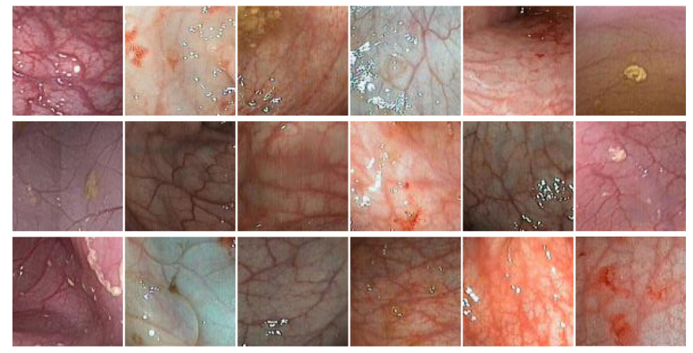
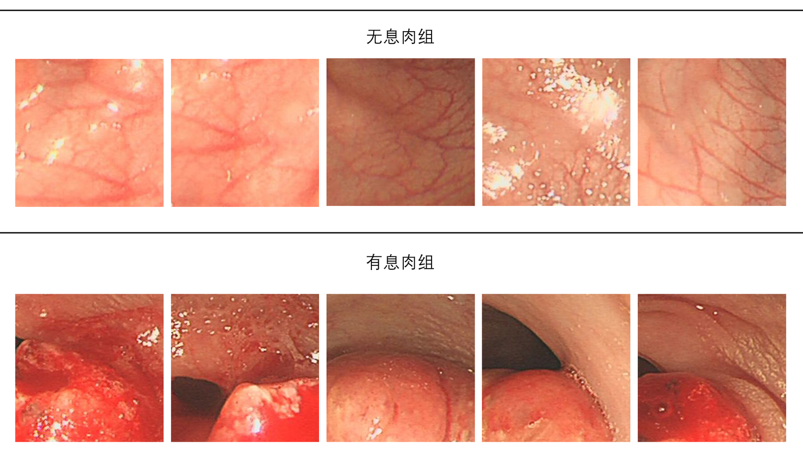

# CP-CHILD

<div align="center">
    <a href="https://github.com/openmedlab/"></a>
</div>
<p style="text-align:center;font-size:10px;"><em></em></p>

## Dataset Information

The **CP-CHILD** dataset is a medical image classification dataset jointly developed by **Changsha University of Science and Technology** and **Hunan Children's Hospital**, primarily aimed at machine learning research in gastroenterology. The dataset includes two subsets, **CP-CHILD-A** and **CP-CHILD-B**, comprising a total of approximately **9,500 endoscopic images**. Each subset is divided into a training set and a test set and is annotated for binary classification based on the presence or absence of polyps.

The primary goal of this dataset is to support the development and evaluation of **colonic polyp detection algorithms**, which are crucial for the early prevention of colorectal cancer. The dataset adopts a well-defined binary classification structure, where each image is clearly labeled as either **polyp** or **non-polyp**, making it particularly suitable for training and evaluating supervised learning models.

## Dataset Meta Information

| Dimensions | Modality  | Task Type      | Anatomical Structures | Anatomical Area | Number of Categories | Data Volume | File Format |
|------------|-----------|----------------|-----------------------|-----------------|----------------------|-------------|-------------|
| 2D         | Endoscopy | Classification | Colon                 | Pelvic          | 2                    | 9500        | .JPG        |


### Resolution Details

| Dataset Statistics | size        |
|--------------------|-------------|
| min                | (256, 256)  |
| median             | (256, 256)  |
| max                | (256, 256)  |

## Label Information Statistics

| Anatomical Structure | Polyp              | Non-Polyp         |
|-----------------------|--------------------|-------------------|
| Occurrences          | 8100              | 1400             |
| Percentage           | 85.26%            | 14.74%           |
| Minimum Volume (cm³) | 256 x 256          | 256 x 256         |
| Median Volume (cm³)  | 256 x 256          | 256 x 256         |
| Maximum Volume (cm³) | 256 x 256          | 256 x 256         |


## Visualization

<div align="center">
    <a href="https://github.com/openmedlab/"></a>
</div>
<p style="text-align:center;font-size:10px;"><em>No polyp/with polyp comparison.</em></p>

## File Structure

``` 
CP-CHILD
├── CP-CHILD-A
│   ├── Test
│   │   ├── Non-Polyp
│   │   │   ├── 0 (1).jpg    
│   │   │   ├── 0 (10).jpg
│   │   │   └── ...
│   │   └── Polyp
│   │       ├── 1 (1).jpg   
│   │       ├── 1 (10).jpg
│   │       └── ...
│   └── Train
│       ├── Non-Polyp
│       │   ├── 0 (1).jpg
│       │   ├── 0 (10).jpg
│       │   └── ...
│       └── Polyp
│           ├── 1 (1).jpg
│           ├── 1 (10).jpg
│           └── ...
├── CP-CHILD-B
│   ├── Test
│   │   ├── Non-Polyp
│   │   │   ├── 0 (1).jpg
│   │   │   ├── 0 (10).jpg
│   │   │   └── ...
│   │   └── Polyp
│   │       ├── 1 (1).jpg
│   │       ├── 1 (10).jpg
│   │       └── ...
│   └── Train
│       ├── Non-Polyp
│       │   ├── 0 (1).jpg
│       │   ├── 0 (10).jpg
│       │   └── ...
│       └── Polyp
│           ├── 1 (1).jpg
│           ├── 1 (10).jpg
│           └── ...
└── README.txt
```

## Authors and Institutions

- **Wei Wang** (Changsha University of Science and Technology)  
- **Jinge Tian** (Changsha University of Science and Technology)  
- **Chengwen Zhang** (Changsha University of Science and Technology)  
- **Yanhong Luo** (Hunan Children's Hospital)  
- **Xin Wang** (Changsha University of Science and Technology)  
- **Ji Li** (Changsha University of Science and Technology)  

## Source Information

Official Website: 

- https://figshare.com/articles/dataset/CP-CHILD_a_three-class_colon_polyp_dataset/13159811
- kaggle: https://www.kaggle.com/datasets/mah

Download Link: https://www.kaggle.com/datasets/mahdieh002/colonoscopy-cp-child?resource=download

Article Address: https://link.springer.com/article/10.1186/s12880-020-00482-3

Publication Date: 2020-07

## Citation

``` 
@article{wang2020improved,
  title={An improved deep learning approach and its applications on colonic polyp images detection},
  author={Wang, Wei and Tian, Jinge and Zhang, Chengwen and Luo, Yanhong and Wang, Xin and Li, Ji},
  journal={BMC Medical Imaging},
  volume={20},
  pages={1--14},
  year={2020},
  publisher={Springer}
}
```

Original introduction article is [here]().