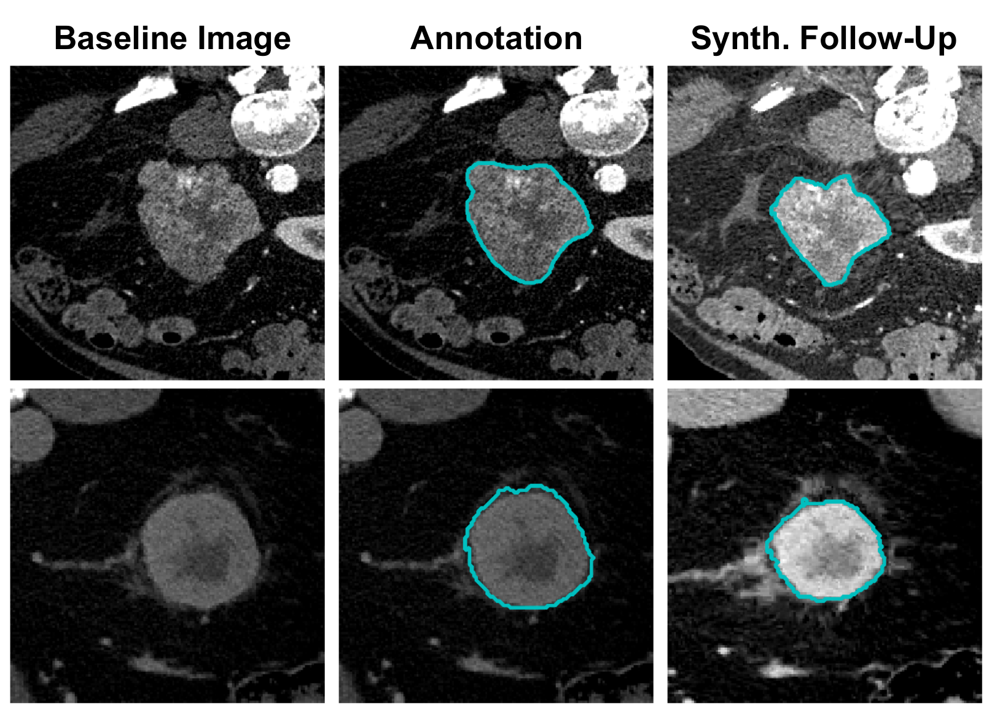

# LesionLocator Longitudinal CT Tumor Dataset with Follow-Ups

This dataset is accompanying the CVPR 2025 paper: **"LesionLocator: Zero-Shot Universal Tumor Segmentation and Tracking in 3D Whole-Body Imaging"**  
[📄 Paper Link](https://openaccess.thecvf.com/content/CVPR2025/html/Rokuss_LesionLocator_Zero-Shot_Universal_Tumor_Segmentation_and_Tracking_in_3D_Whole-Body_CVPR_2025_paper.html)  
[📁 GitHub Repo](https://github.com/MIC-DKFZ/LesionLocator)

---

## Dataset Information

The **LesionLocator Longitudinal CT Tumor Dataset with Synthetic Follow-Ups** is a large-scale medical imaging dataset designed for universal tumor segmentation and longitudinal tracking. It includes simulated follow-up scans with consistent **instance-based labels**, enabling research into robust lesion segmentation, synthetic deformation handling, and temporal tracking in medical imaging.

The dataset incorporates multi-organ lesion data synthesized from a diverse set of real-world medical imaging collections and provides consistent lesion labeling across simulated timepoints.

---

## Dataset Meta Information

| Dimensions | Modality | Task Type     | Anatomical Structures | Anatomical Area | Number of Categories | Data Volume | File Format |
|------------|----------|----------------|------------------------|------------------|----------------------|-------------|-------------|
| 3D         | CT       | Segmentation, Longitudinal Tracking | Tumors (various origins) | Whole-body, multi-organ | 1 (Instance-based labeling) | ~700 GB     | .nii.gz     |

### Resolution Details

| Dataset Statistics | spacing (mm)          | size               |
|--------------------|------------------------|--------------------|
| min                | (0.66, 0.66, 2.0)        | (512, 512, 122)    |
| median             | (0.84, 0.84, 3.0)        | (512, 512, 148)    |
| max                | (0.98, 0.98, 3.0)        | (512, 512, 427)    |

---

## Label Information Statistics

| Metric                  | Tumor Lesions (Instance-Based) |
|-------------------------|--------------------------------|
| Case Count              | 5,304                          |
| Longitudinal Cases      | 1 real image, 1 syntetic follow-up |
| Instance Labels         | True                        |

---

## Visualization

Below are example images of lesions and follow-up pairs.

<div align="center">
    
</div>
<p style="text-align:center;font-size:10px;"><em>Example: ITK-SNAP visualization of lesion progression across synthetic follow-ups.</em></p>

---

## File Structure


The dataset file structure is as follows. The LesionLocator Longitudinal CT Tumor Dataset primarily consists of two parts: the original images sourced from public datasets with instance wise lesion labels and the processed synthetic dataset with a new timepoint for each case mimicing a follow-up scan.

``` 
LesionLocator_SynteticLongitudinalDataset
│
├── Baseline
│   ├── images
│   └── labels
│
├── Synthetic_Follow_Up
│   ├── images
│   └── labels
│
│ naming.csv
│ README.md

```

This dataset incorporates lesion data from various publicly available sources:  

- **[COVID-19 CT Lung](https://zenodo.org/records/3757476)**  
- **[KiTS](https://kits-challenge.org/kits23/)**  
- **[LIDC](https://www.cancerimagingarchive.net/collection/lidc-idri/)**  
- **[LNDb](https://lndb.grand-challenge.org/)**  
- **[MSD Colon](http://medicaldecathlon.com/)**  
- **[MSD Hepatic Vessels](http://medicaldecathlon.com/)**  
- **[MSD Liver](http://medicaldecathlon.com/)**  
- **[MSD Lung](http://medicaldecathlon.com/)**  
- **[MSD Pancreas](http://medicaldecathlon.com/)**  
- **[NIH Lymph](https://www.cancerimagingarchive.net/collection/ct-lymph-nodes/)**  
- **[NSCLC Radiomics](https://www.cancerimagingarchive.net/collection/nsclc-radiomics/)** 

## Authors and Institutions

Maximilian Rokuss (Division of Medical Image Computing, German Cancer Research Center, Germany)

## Source Information

Official Website: https://github.com/MIC-DKFZ/LesionLocator

Download Link: [direct download](https://doi.dkfz.de/10.6097/DKFZ/IR/E230/20250324_1.zip)

Publication Date: April 2025

## Citation

```bibtex
@InProceedings{Rokuss_2025_CVPR,
    author    = {Rokuss, Maximilian and Kirchhoff, Yannick and Akbal, Seval and Kovacs, Balint and Roy, Saikat and Ulrich, Constantin and Wald, Tassilo and Rotkopf, Lukas T. and Schlemmer, Heinz-Peter and Maier-Hein, Klaus},
    title     = {LesionLocator: Zero-Shot Universal Tumor Segmentation and Tracking in 3D Whole-Body Imaging},
    booktitle = {Proceedings of the Computer Vision and Pattern Recognition Conference (CVPR)},
    month     = {June},
    year      = {2025},
    pages     = {30872-30885}
}
```