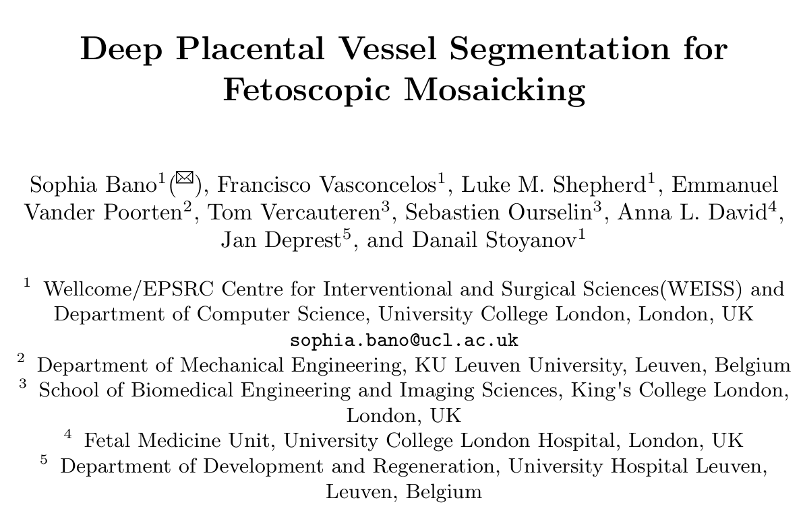
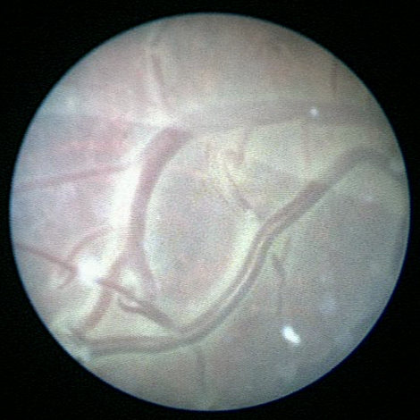
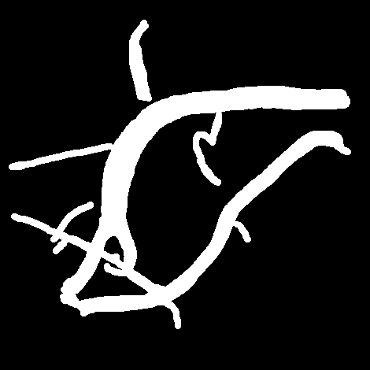

# PSVFM

<div align="center">
    <a href="https://github.com/openmedlab/"></a>
</div>
<p style="text-align:center;font-size:10px;"><em></em></p>

## Dataset Information

The **PSVFM (Placental Vessel Segmentation for Fetoscopic Mosaicking)** dataset is a dataset designed for placental vessel segmentation in fetoscopic images. It contains a total of **483 surgical images** extracted from six different fetoscopic surgery videos, along with their corresponding placental vessel segmentation annotations. By training a placental vessel segmentation network on this dataset, the authors achieved significantly better results compared to existing methods at the time. Additionally, the authors demonstrated that vessel-based registration for fetoscopic images is more reliable than directly registering raw images, especially when vessels are visible.

This fetoscopic vessel dataset is the **first publicly available dataset for placental vessel segmentation**, consisting of **483 manually annotated in vivo fetoscopic images** and six video clips. It holds high medical and technical value. The data originate from real cases of **twin-to-twin transfusion syndrome (TTTS)** surgeries, encompassing various visibility challenges such as poor lighting conditions, dynamic occlusions, and significant appearance variations. This dataset provides an essential benchmark for the development and evaluation of placental vessel segmentation and mosaicking algorithms. 

The dataset not only advances the application of deep learning in fetoscopic surgeries but also offers a reliable data foundation for optimizing computer-assisted intervention technologies. Specifically, it can enhance vessel recognition, navigation accuracy, and intraoperative decision-making in TTTS surgeries.

## Dataset Meta Information

| Dimensions | Modality      | Task Type      | Anatomical Structures  | Number of Categories | Data Volume | File Format |
|------------|---------------|----------------|------------------------|----------------------|-------------|-------------|
| 2D         | Fetal mirror  | Segmentation   | Fetal blood vessels    | 1                    | 483         | .PNG        |


### Resolution Details

| Dataset Statistics | size       |
|--------------------|------------|
| min                | (470, 470) |
| median             | (550, 550) |
| max                | (720, 720) |

## Label Information Statistics

| Metric        | Fetal blood vessels  |
|---------------|----------------------|
| Case Count    | 482                  |
| Coverage      | 100%                 |

## Visualization

Fetoscopic images and corresponding vascular annotations:

<div align="center">
    <a href="https://github.com/openmedlab/"></a>
</div>
<p style="text-align:center;font-size:10px;"><em></em></p>

<div align="center">
    <a href="https://github.com/openmedlab/"></a>
</div>
<p style="text-align:center;font-size:10px;"><em></em></p>

## File Structure

``` 
Fetoscopy_Placenta_Data/
└── Fetoscopy Placenta Dataset/
    ├── Vessel_registration_unannotated_clips/
    │   ├── video01/
    │   │   ├── images/
    │   │   │   ├── anon001_00851.png
    │   │   │   ├── anon001_00852.png
    │   │   │   ├── anon001_00853.png
    │   │   │   └── ...
    │   │   ├── masks_predicted/
    │   │   │   ├── anon001_00851.png
    │   │   │   ├── anon001_00852.png
    │   │   │   ├── anon001_00853.png
    │   │   │   └── ...
    │   ├── video02/
    │   │   └── ...
    │   ├── video03/
    │   │   └── ...
    │   └── ...
    ├── Vessel_segmentation_annotations/
    │   ├── video01/
    │   │   ├── images/
    │   │   │   ├── anon001_02785.png
    │   │   │   ├── anon001_02807.png
    │   │   │   ├── anon001_02830.png
    │   │   │   └── ...
    │   │   ├── masks_gt/
    │   │   │   ├── anon001_02785_mask.png
    │   │   │   ├── anon001_02807_mask.png
    │   │   │   ├── anon001_02830_mask.png
    │   │   │   └── ...
    │   ├── video02/
    │   │   └── ...
    │   ├── video03/
    │   │   └── ...
    │   └── ...
```

## Authors and Institutions

Sophia Bano (Wellcome/EPSRC Centre for Interventional and Surgical Sciences (WEISS), Department of Computer Science, University College London, London, UK)

Francisco Vasconcelos (Wellcome/EPSRC Centre for Interventional and Surgical Sciences (WEISS), Department of Computer Science, University College London, London, UK)

Luke M. Shepherd (Wellcome/EPSRC Centre for Interventional and Surgical Sciences (WEISS), Department of Computer Science, University College London, London, UK)

Emmanuel Vander Poorten (Department of Mechanical Engineering, KU Leuven University, Leuven, Belgium)

Tom Vercauteren (School of Biomedical Engineering and Imaging Sciences, King's College London, London, UK)

Sebastien Ourselin (School of Biomedical Engineering and Imaging Sciences, King's College London, London, UK)

Anna L. David (Fetal Medicine Unit, University College London Hospital, London, UK)

Jan Deprest (Department of Development and Regeneration, University Hospital Leuven, Leuven, Belgium)

Danail Stoyanov (Wellcome/EPSRC Centre for Interventional and Surgical Sciences (WEISS), Department of Computer Science, University College London, London, UK)

## Source Information

Official Website: https://www.ucl.ac.uk/interventional-surgical-sciences/weiss-open-research/weiss-open-data-server/fetoscopy-placenta-data

Download Link: https://www.ucl.ac.uk/interventional-surgical-sciences/weiss-open-research/weiss-open-data-server/fetoscopy-placenta-data

Article Address: https://arxiv.org/pdf/2007.04349

Publication Date: 2020-07

## Citation

``` 
@inproceedings{bano2020deep,
  title={Deep placental vessel segmentation for fetoscopic mosaicking},
  author={Bano, Sophia and Vasconcelos, Francisco and Shepherd, Luke M and Vander Poorten, Emmanuel and Vercauteren, Tom and Ourselin, Sebastien and David, Anna L and Deprest, Jan and Stoyanov, Danail},
  booktitle={Medical Image Computing and Computer Assisted Intervention--MICCAI 2020: 23rd International Conference, Lima, Peru, October 4--8, 2020, Proceedings, Part III 23},
  pages={763--773},
  year={2020},
  organization={Springer}
}
```

Original introduction article is [here](https://zhuanlan.zhihu.com/p/7738022134).